# Modo de uso

## Índice

- [Modo de uso](#modo-de-uso)
  - [Índice](#índice)
  - [Resumen](#resumen)
  - [Anatomía de la página](#anatomía-de-la-página)
  - [Estructura de carpetas de la página](#estructura-de-carpetas-de-la-página)
    - [Estructura de carpetas de una vista. Ejemplo: "Main view"](#estructura-de-carpetas-de-una-vista-ejemplo-main-view)
  - [Añadir contenido a la página](#añadir-contenido-a-la-página)
    - [Cómo crear una vista](#cómo-crear-una-vista)
    - [Cómo crear un contenido (componente)](#cómo-crear-un-contenido-componente)
    - [Resumen creación contenido](#resumen-creación-contenido)
  - [Estilos](#estilos)
    - [Título principal de la página](#título-principal-de-la-página)
    - [Tablas](#tablas)
    - [Texto explicativo de una figura (Tabla, imagen, etc.)](#texto-explicativo-de-una-figura-tabla-imagen-etc)
    - [Código](#código)
    - [Imagen/gif](#imagengif)

## Resumen

Esta página es una SPA que utiliza `WebComponents` para crear contenido basado en `componentes` y que genera los enlaces del navbar y sidebar automáticamente en base a una configuración en JSON de tal manera que para generar nuevo contenido solo haya que preocuparse de generar componentes y modificar la configuración de los JSONs.

## Anatomía de la página

La página se compone de los siguientes elementos:

- `Navbar`: barra superior de navegación, al pulsar los enlaces se podrá cambiar de `vista`

- `Sidebar`: barra lateral de navegación, al pulsar los enlaces se podrá cambiar de `contenido`

- `Contenido`: html que se renderiza en la parte principal de la página. En esta sección se pondrá la información de lo que se quiera explicar, imágenes etc. En cada `contenido` se tratará un tema concreto. A nivel técnico los distintos contenidos seran componentes creados con WebComponents de javascript.

- `Vista`: Engloba el `sidebar` y el `contenido`, cada vista tendrá un sidebar diferente y varios contenidos accesibles desde el sidebar. En cada vista se tratará un tema genérico.

- `Icono de la vista`: Icono que aparecerá en la `navbar`y que irá cambiando con cada vista.

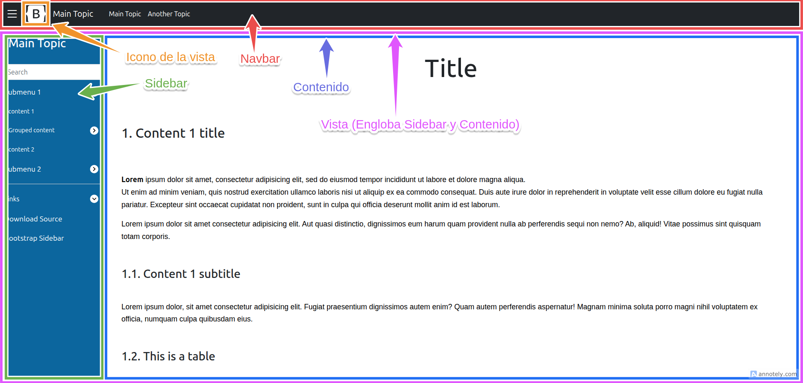

## Estructura de carpetas de la página

```bash
/
|
+-- components
|   |
|   +--vista-1
|   |  |
|   |  +--common
|   |  |  |
|   |  |  +--assets
|   |  |     |
|   |  |     +--img
|   |  |     |  |
|   |  |     |  +--logo.svg
|   |  |     |
|   |  |     +--sidebar.json
|   |  |
|   |  +--contenido-1 (componente)
|   |  |  |
|   |  |  +--assets (assets del contenido como imágenes o gifs, el contenido puede tener carpeta de assets o no)
|   |  |  |
|   |  |  +--contenido-1.html
|   |  |  |
|   |  |  +--contenido-1.js
|   |  |
|   |  +--contenido-2 (componente)
|   |  |  |
|   |  |  ...
|   |  |
|   |  ...
|   |
|   +--vista-2
|   |  |
|   |  ...
|   ...
|
+--img (imágenes para README)
|  |
|  +--imagen-1
|  |
|  ...
|
+--js
|  |
|  +--components-imports.js (Archivo para importar los componentes generados)
|
+--index.html (html principal de la página, no se debe modificar)
|
+--README.md
```

Ejemplo estructura de carpetas dentro de components:

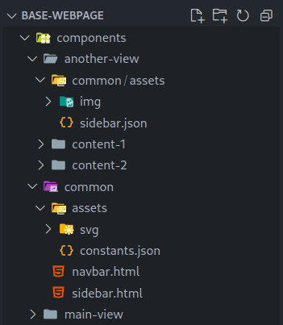

Todo el contenido de la página irá dentro de la carpeta components. 

- Dentro de esta carpeta está la carpeta common, necesaria para el correcto funcionamiento de la página. 
  
- Dentro de la carpeta common, el único archivo que hay que modificar es el archivo `components/common/assets/constants.json`

- Por otra parte, al mismo nivel que la carpeta common, se encuentran las carpetas que representarán el contenido de cada uno de los enlaces que aparecen en el `navbar` y al que llamaremos `vistas`

>[!NOTE]
> - En este ejemplo se pueden ver dos enlaces en el `navbar`: Main Topic y Another Topic.  
> - Cada uno de estos enlaces llevará a una `vista`, que son la main-view y la another-view respectivamente.  
>  - Las carpetas dentro de las cuales se guardará todo lo relacionado con estas vistas se pueden ver en la imagen anterior.


- Por último, dentro de cada carpeta de `vista`, se encontrarán las siguientes carpetas:
  
  1. common: Dentro de esta carpeta se encontrarán el icono de la vista y el json que definirá los enlaces que aparecen en el `sidebar` y que llevarán a cada uno de los `contenidos`
  
  2. varias carpetas de `contenido`, dentro de las cuales se encontrarán las imágenes utilizadas en dicho contenido, el html del contenido y el js que se encargará de crear el `componente`  
   

### Estructura de carpetas de una vista. Ejemplo: "Main view"

```bash
main-view
|
+--common
|  |
|  +--assets
|     |
|     +--img
|     |  |
|     |  +--logo.svg
|     |
|     +--sidebar.json
|
+--content-1 (componente)
|  |
|  +--assets (assets de este contenido como imágenes o gifs, no todos los contenidos tienen assets)
|  |  |
|  |  +--gif
|  |  |  |
|  |  |  +--gif-1.gif
|  |  |
|  |  +--img
|  |     |
|  |     +--bootstrap.png
|  |   
|  +--content-1.html
|  |
|  +--content-1.js
|
+--content-2 (componente)
|  |
|  ...
|
+--content-3 (componente)
|  |
|  ...
|
+--content-4 (componente)
   |
   ...
```

Imagen de la estructura de carpetas de la vista main view:

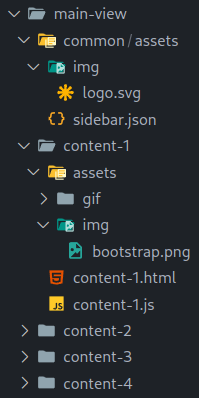

> [!Note]
> - El logo de esa `vista` debe estar dentro de la carpeta `<ruta_a_la_vista>/common/assets/img/logo.svg`
> - El json que define qué enlaces se verán en el `sidebar` debe encontrarse en la ruta `<ruta_a_la_vista>/common/assets/sidebar.json`

- Esta `vista` tendrá varios `contenidos` accesibles desde el `sidebar`. 
  
- En este ejemplo, estos `contenidos` están definidos dentro de las carpetas content-1, content-2, content-3 y content-4
  
- Dentro de estas carpetas se encontrarán el `componente` (compuestos por un html y un js) y una carpeta assets, donde se guardarán las imágenes y otros archivos externos que se usarán dentro de este componente

>[!NOTE]
>Al cargar una vista se cargará el primer `contenido` que esté definido en el sidebar, en este caso el content-1.

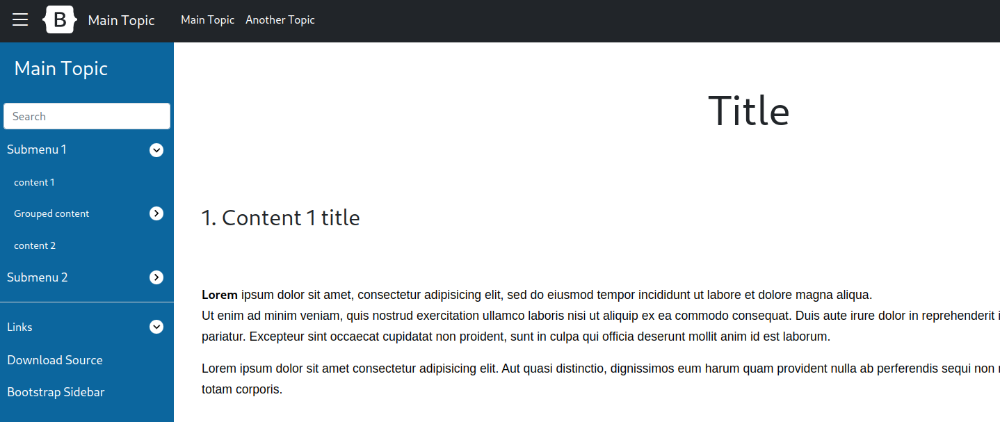

## Añadir contenido a la página

### Cómo crear una vista

1. En primer lugar, dentro de la carpeta components se debe crear la siguiente estructura de carpetas dentro de la carpeta `components`:

```bash
components
|
+--Nueva vista
   |
   +--common
      |
      +--assets
         |
         +--img
         |  |
         |  +--logo.svg
         |
         +--sidebar.json
```

- `logo.svg`: Será el logo que se muestre en el navbar y cambiará al cambiar de vista.
  
- `sidebar.json`: Al principio estará vacío y se irá poblando según se vayan añadiendo `contenidos`. 

2. Para que se termine de crear la nueva vista se le debe añadir por lo menos un `contenido` (componente).

3. Añadir la vista en el navbar

    >[!Note]
    >Para este ejemplo se creará una vista que se llame `bootstrap`.

    Para que la nueva vista aparezca en el navbar se debe modificar el archivo `/comon/assets/constants.json`.

    1. Se deberá crear un nuevo objeto en el JSON a nivel de la raíz, el `identificador del nuevo objeto JSON` puede ser el que se quiera mientras sea único, para este ejemplo, el identificador será `nuevaVista`.   
    
        >[!Note]
        >Cuando se carga la página, se cargará automáticamente la `vista` cuyo `identificador de objeto JSON` sea `mainView`.
    
    2. Dentro de este objeto debe haber dos propiedades: `topic` y `basepath`.
  
         - `topic`: Es el texto del enlace que aparecerá en el navbar.
         
         - `basepath`: Es la ruta donde se encuentra la capeta de la `vista` que se acaba de crear. 
  
    ```json
    {
      "common" : {
          "paths" : {
              "navbar" : "components/common/navbar.html",
              "sidebar" : "components/common/sidebar.html"
          }
      },
      "nuevaVista" : {
          "topic" : "Bootstrap (Texto que aparecerá en el navbar)",
          "basePath" : "components/bootstrap"
      },
      "mainView" : {
          "topic" : "Main Topic",
          "basePath" : "components/main-view"
      },
      ...
    }
    ``` 

    Resultado:

    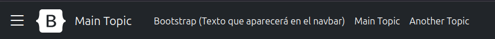

    >[!Note]
    >Al pulsar en un enlace del navbar se cargará la `vista` correspondiente. Al cargarse una `vista` se cargará automáticamente el `contenido` correspondiente al primer enlace del `sidebar` de esa `vista`.

### Cómo crear un contenido (componente)

   1. En primer lugar se deberá crear una carpeta de `vista` donde se guardarán varios `contenidos` que tengan que ver con el mismo tema (Descrito en el paso anterior). 

       >[!NOTE]
       > `Ejemplo`: si vamos a hablar de bootstrap y vamos a hacer un `contenido` que habla sobe el origen de bootstrap y otro `contenido` que habla sobre como usar bootstrap:    
       >1. Dentro de la carpeta components se creará una carpeta llamada bootstrap, que será la `vista`.   
       >
       >2. Dentro de la carpeta bootstrap se crearán una carpeta `common` y a parte una carpeta por cada `contenido`.   
       >  
       >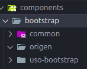 

   2. En segundo lugar, dentro de la carpeta del `contenido`, hay que crear un html y un js

       ```bash
       components
       |
       +--Vista
         |
         +--common
         |  |
         |  +--...(Contenido descrito en el paso anterior)
         |
         +---Nuevo contenido
             |
             +--nuevo-contenido.html
             |
             +--nuevo-contenido.js
       ``` 
       
       >[!Note]
       >Siguiendo con el `ejemplo` de la vista de boostrap, lo que habrá dentro de la carpeta del `contenido` sobre el origen de boostrap será lo siguiente:    
       >
       >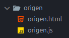

       - `HTML`: En este archivo se escribirá todo lo que se quiera que renderizará en la zona de contenido:
      
           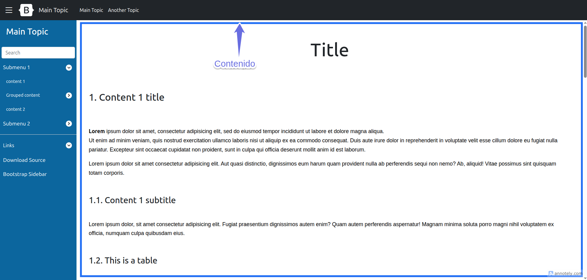

       - `JS`: En este archivo se creará el WebComponent a nivel de javascript y se establecerá cual será el `nombre de etiqueta del componente`.

         >[!Important]
         > - Se debe copiar siempre este código y sustituir lo siguientes elementos:  
         >
         >   - El valor de `tagName` se sustituirá por el nombre de etiqueta que se le quiera dar al webcomponent (nombre inventado pero que empiece por la palabra component)   
         >
         >   - El valor de `htmlFileName` se sustituirá por el nombre del html que corresponda a dicho componente.  
         

         ```javascript
         import { createComponent } from "https://antoniocortes.github.io/base-webpage/js/component-generator.js";

         const tagName = 'component-bootstrap-origin';
         const htmlFilename = 'origen.html';

         const baseUrl = import.meta.url.substring(0, import.meta.url.lastIndexOf('/') + 1);
         createComponent(tagName, baseUrl + htmlFilename);
         ```

   3. Añadir el nuevo componente creado al archivo components-imports.js

       Una vez creado el nuevo WebComponent, debe importarse el js que define ese WebComponent mediante una ruta relativa en el archivo `/js/components/imports.js`

       ```javascript
       //Nuevo componente origen de bootstrap
       import '../components/bootstrap/origen/origen.js';
       ```
           
   4. Añadir un enlace del componente recién creado al sidebar

      Para añadir un enlace del nuevo contenido (componente) creado al sidebar se debe modificar el archivo `/components/nueva-vista/common/assets/sidebar.json`.

      Anatomía del sidebar:

      - `Rojo`: Zona de los enlaces a contenidos de la página
      
      - `verde`: Zona de enlaces a páginas de documentación externas 

      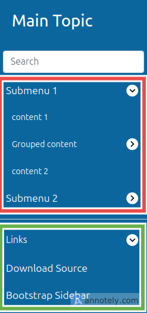

      Anatomía del `sidebar.json`:

      El `sidebar.json` debe tener dos objetos que contentrán listas, los objetos se llamarán `pageContent` y `links`:

      - `pageContent`: Aquí se definirán los enlaces a la propia página mediante `objetos JSON` que tendrán dos propiedades, que se llamarán `text` y `content`.
    
        - `text`: El texto que aparecerá en el sidebar.
        
        - `content`: El nombre de etiqueta que se le ha dado al `WebComponent` en el paso anterior.

        ```json
        {
          "text": "texto que aparecerá en el sidebar",
          "content": "nombre-etiqueta-webcomponent"
        }
        ``` 

      - `links`: Aquí se definirán los enlaces a páginas externas de documentación mediante `objetos JSON` que tendrán dos propiedades, que se llamarán `text` y `content`.

          - `text`: El texto que aparecerá en el sidebar.

          - `content`: Dirección web de la página de documentación.

          ```json
          {
            "text": "texto que aparecerá en el sidebar",
            "content": "https://dirección-pagina-documentación"
          }
          ``` 
    
        Ejemplo `sidebar.json`:

        ```json
        {
            "pageContent" : [
              {
                "text": "texto que aparecerá en el sidebar",
                "content": "nombre-etiqueta-webcomponent"
              }
            ],
            "links" : [
              {
                "text": "texto que aparecerá en el sidebar",
                "content": "https://dirección-pagina-documentación"
              }
            ]
        }
        ```

        >[!Note]
        >Siguiendo con el ejemplo de la nueva vista de `bootstrap` y el contenido sobre el origen de bootstrap llamado `origen` cuya definición del `WebComponent` se encuentra en el archivo `origen.js`, para añadir un enlace a ese `componente` en el `sidebar` habría que modificar el archivo `components/bootstrap/common/assets/sidebar.json`.

        ```json
        {
            "pageContent" : [
                {
                    "text": "Origen de Bootstrap",
                    "content": "component-bootstrap-origin"
                }
            ],
            "links" : [
                {
                    "text" : "Página oficial de Bootstrap",
                    "href" : "https://getbootstrap.com/"
                }
            ]
        }
        ```

        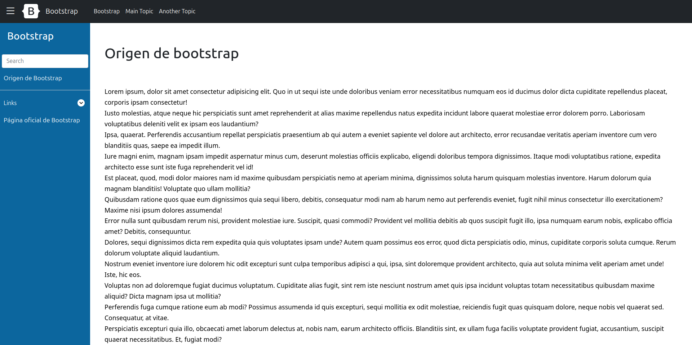

        >[!Tip]
        >Si en el `sidebar` se quiere hacer un submenú desplegable como en el siguiente ejemplo:   
        >   
        >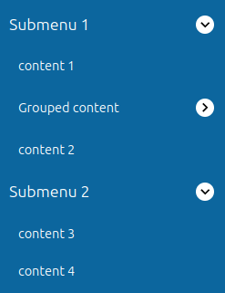
        >
        >Dentro de la propiedad `content` del objeto `JSON` correspondiente, en lugar del `nombre de etiqueta` de un `WebComponent` se debe poner una lista dentro de la cual se definirán los enlaces.   
        >Esto se puede hacer recursivamente para hacer submenús dentro de submenús.

        ```json
        {
          "pageContent" : [
              {
                  "text": "Origen de Bootstrap",
                  "content": "component-bootstrap-origin"
              },
              {
                  "text": "Submenu 1",
                  "content": [
                      {
                          "text": "Submenu anidado",
                          "content":  [
                              {
                                  "text": "De nuevo origen de Bootstrap",
                                  "content": "component-bootstrap-origin"
                              }
                          ]
                      }
                  ]
              }
          ],
          "links" : [
              {
                  "text" : "Página oficial de Bootstrap",
                  "href" : "https://getbootstrap.com/"
              }
          ]
        }
        ```
        Resultado:

        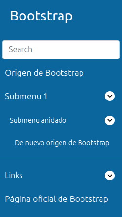


### Resumen creación contenido

   1. Dentro de la carpeta `components`, crear la estructura de carpetas y archivos necesarios para la `vista` y el `contenido` si es que aún no están creados.

       ```bash
       components
       |
       +--Vista
          |
          +--common
          |  |
          |  +--assets
          |  |
          |  +--img
          |  |  |
          |  |  +--logo.svg
          |  |
          |  +--sidebar.json
          |
          +---Nuevo contenido
              |
              +--nuevo-contenido.html
              |
              +--nuevo-contenido.js
       ``` 

   2. Dentro de la carpeta de `contenido` que se acabe de crear:

        - En el archivo `.html` escribir el código html que se quiera renderizar en la página en la zona del `contenido`.
     
        - En el archivo `.js` copiar el siguiente código para crear el WebComponent:

           >[!Important]
           > - Se debe copiar siempre este código y sustituir lo siguientes elementos:
           >
           >   - El valor de `tagName` se sustituirá por el nombre de etiqueta que se le quiera dar al webcomponent (nombre inventado pero que empiece por la palabra component)   
           >
           >   - El valor de `htmlFileName` se sustituirá por el nombre del html que corresponda a dicho componente. 

           ```javascript
           import { createComponent } from "https://antoniocortes.github.io/base-webpage/js/component-generator.js";

           const tagName = 'component-nuevo-contenido';
           const htmlFilename = 'nuevo-contenido.html';

           const baseUrl = import.meta.url.substring(0, import.meta.url.lastIndexOf('/') + 1);
           createComponent(tagName, baseUrl + htmlFilename);
           ```

   3. Añadir el nuevo componente creado al archivo components-imports.js

       Una vez creado el nuevo WebComponent, debe importarse el js que define ese WebComponent mediante una ruta relativa en el archivo `/js/components/imports.js`

       ```javascript
       import '../components/Vista/Nuevo contenido/nuevo-contenido.js';
       ```

   4. Añadir un enlace del componente recién creado al sidebar 
      
      Modificar el archivo `sidebar.json` para añadir un enlace al nuevo componente:

      ```json
       {
           "pageContent" : [
             {
               "text": "texto que aparecerá en el sidebar",
               "content": "component-nuevo-contenido"
             }
           ],
           "links" : [
             {
               "text": "texto que aparecerá en el sidebar",
               "content": "https://dirección-pagina-documentación"
             }
           ]
       }

   5. (Solo si la vista se acaba de crear) Si aún no está añadido el enlace a la nueva vista en el `navbar`, añadir un nuevo enlace en el navbar modificando el archivo `/components/common/assets/constants.json`.

       ```json
       {
         "common" : {
             "paths" : {
                 "navbar" : "components/common/navbar.html",
                 "sidebar" : "components/common/sidebar.html"
             }
         },
         "nuevaVista" : {
             "topic" : "Nueva Vista",
             "basePath" : "components/Vista"
         }
       }
       ```
       
## Estilos

### Título principal de la página

El título principal de la página debe llevar la clase `title` para que se vea centrado en la pantalla y con el tamaño adecuado.

```html
<h1 class="title">Title</h1>
```

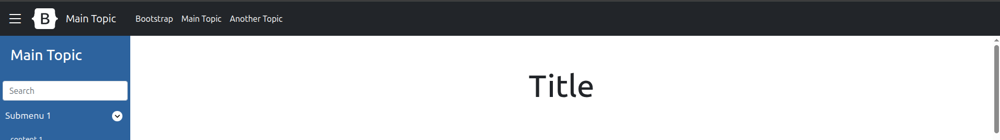

### Tablas

Las tablas deben llevar las clases `table`, `table-striped` y `table-hover`.

```html
<table class="table table-striped table-hover">
	<thead>
		<tr>
			<th scope="col">#</th>
			<th scope="col">First</th>
			<th scope="col">Last</th>
			<th scope="col">Handle</th>
      	</tr>
    </thead>
    <tbody>
      	<tr>
        	<th scope="row">1</th>
        	<td>Mark</td>
        	<td>Otto</td>
        	<td>@mdo</td>
      	</tr>
      	<tr>
        	<th scope="row">2</th>
        	<td>Jacob</td>
        	<td>Thornton</td>
        	<td>@fat</td>
      	</tr>
      	<tr>
        	<th scope="row">3</th>
        	<td colspan="2">Larry the Bird</td>
        	<td>@twitter</td>
      	</tr>
	</tbody>
</table>
```

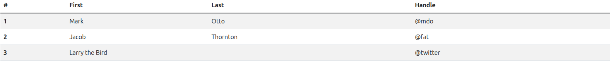

### Texto explicativo de una figura (Tabla, imagen, etc.)

Los textos explicativos que se añaden debajo de una figura deben ser `span` que tengan las clases `center-horizontal` y `caption`.

```html
<span class="center-horizontal caption">Example table</span>
```

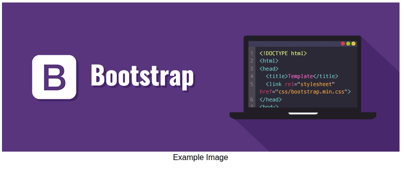

### Código

Para añadir un segmento de código a la página, dicho segmento de código de be tener la estructura `<div><pre><code> codigo </code></pre></div>`.

- El `div` debe tener la clase `center-horizontal`.

- El `code` debe tener la clase `language-<nombre_lenguaje>`

>[!Warning]
>Para que el fragmento de código se muestre correctamente las identaciones del `div`, `pre` y `code` deben ser como las que se muestran a continuación

```html
<div class="center-horizontal">
<pre><code class="language-java">
public class HelloWorld
{
	public static void main(String[] args)
	{
		System.out.println("This is a hello world in Java");
	}
}
</code></pre>
</div>
```

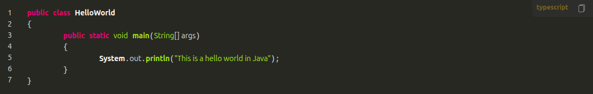

### Imagen/gif

Las imágenes y gifs deben llevar la clase `center-hotizontal` para que se vean centrados horizontalmente en la pantalla.

```html

```

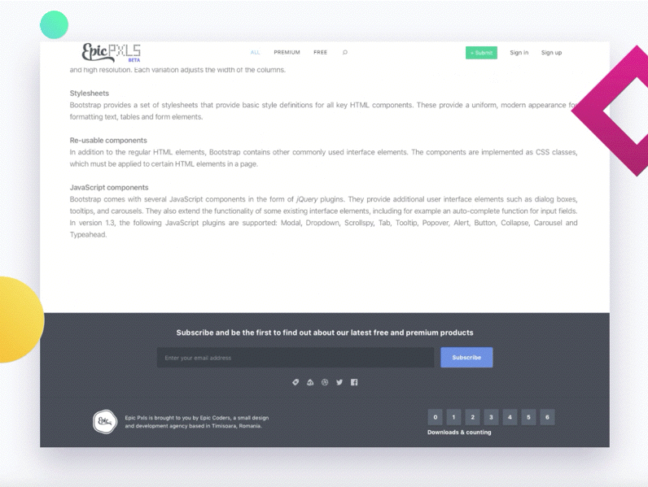
